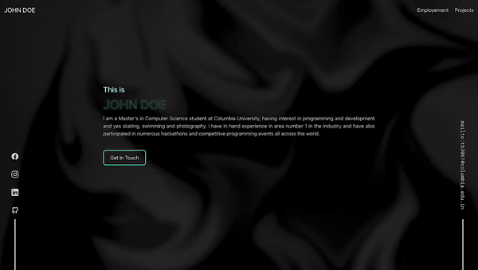

# Dark and neon themed personal website
Link to the portfolio: https://tanishabisht.github.io/portfolio-template-1/



## Who is this portfolio website for?
This portfolio is designed for professionals who specialize in digital art or software development. It is tailored for individuals whose work is innovative and visually-driven, benefiting from a modern and distinctive online presence.

### Style of the Website
The website boasts a visually captivating dark theme enriched by neon highlights and glass-morphism effects. This style not only showcases the portfolio effectively but also ensures it stands out to visitors through its unique and engaging aesthetic.

### Font Choice: Montserrat
Montserrat, with its geometric structure and contemporary feel, is chosen to complement the futuristic theme of the website. Its clean and sharp lines enhance readability and add to the site’s modern vibe.

### Color Choices
- Primary background: Deep gray abtract background (#121212) provides a subtle texture under light, which enhances the visibility of neon elements and is less harsh than pure black.
- Accent colors: Bright neon green (#BEFFF0) serves as the primary accent color, chosen for its vibrancy and energy, which can invigorate the website’s design and attract attention to key areas like calls to action.
- Text and secondary elements: Off-white (#E2E2E2) for primary text ensures high readability against the dark background, offering enough contrast to be clear but soft enough to maintain the overall aesthetic without stark clashes.

## How to Customize and Deploy Your Project

### Step 1: Fork the Repository
Begin by forking the repository to create a personal copy under your GitHub account.

### Step 2: Clone Your Fork
Clone the forked repository to your local machine. Replace `(username)` with your GitHub username and `(newreponame)` with the name of the repository.
```bash
git clone git@github.com:(username)/(newreponame).git
```

### Step 3: Set Up Your Project
Navigate to the project directory:
```bash
cd (newreponame)
```

Switch to the appropriate Node.js version using nvm:
```bash
nvm install v14.21.3
nvm use v14.21.3
```

### Step 4: Install Dependencies
Install the necessary project dependencies:
```bash
npm install
```

### Step 5: Start the Development Server
Launch the development server which will host the project on your local machine:
```bash
npm start
```
- The server will be accessible at `localhost:3000`.

### Step 6: Customize Your Project
Make necessary changes to personalize the project:
- Modify the content in the website by editing the variables in the file located at [variables.js](/src/Content/variables.js).

### Step 7: Update Repository Configuration
Change the repository URL in [package.json](/package.json) to match your GitHub Pages URL:
```json
"https://(username).github.io/(newreponame)"
```
Replace `(username)` with your GitHub username and `(newreponame)` with your repository name.

### Step 8: Deploy Your Changes
Deploy your updated website to GitHub Pages:
```bash
npm run deploy
```

### Step 9: Configure GitHub Pages
- Navigate to your repository on GitHub.
- Go to `Settings` > `Pages`.
- Set the GitHub Pages source to deploy from the `gh-pages` branch and select the `/(root)` folder.
- Click `Save`.

### Step 10: Access Your Deployed Site
- Your website will be available shortly after deployment.
- Access it via `https://(username).github.io/(newreponame)`.

Follow these steps to customize and deploy your project effectively on GitHub Pages, ensuring it reflects your personal style and preferences.

## Contributing
Contributions are what make the open-source community such an amazing place to learn, inspire, and create. Any contributions you make are **greatly appreciated**.
1. Fork the Project
2. Create your Feature Branch (`git checkout -b feature/AmazingFeature`)
3. Commit your Changes (`git commit -m 'Add some AmazingFeature'`)
4. Push to the Branch (`git push origin feature/AmazingFeature`)
5. Open a Pull Request

## License
Distributed under the MIT License. See `LICENSE` for more information.